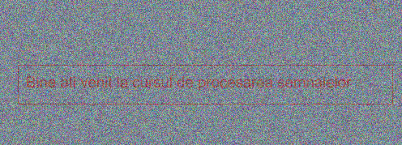
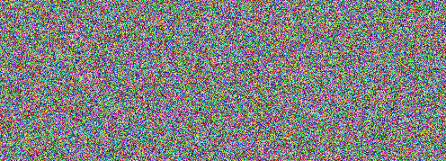
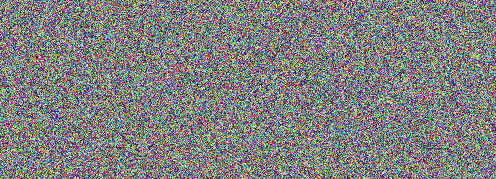

# 🚀 [Introduction to Python](https://ocw.cs.pub.ro/courses/ps/labs_python/01)

---

## 📝 Objectives  

- Perform numerical operations with **NumPy**.  
- Work with vectors, matrices, and transpositions.  
- Visualize data using **Matplotlib**.  
- Process signals and images.  
- Compare **row-major** vs. **column-major** efficiency.  

---

## 🛠️ Key Concepts  

---

### ✅ Python Basics  

- Understanding variables, expressions, and basic arithmetic.  
- Writing and executing Python scripts in **Google Colab** / **PyCharm**.  
- Using Python **3.11** for numerical computation.  

---

### ✅ Working with NumPy  

- Creating **vectors** and **matrices** using **NumPy**.  
- Performing **vectorized operations** for improved efficiency.  
- Indexing and slicing vectors and matrices.  
- Generating **random numbers** and **special matrices** (e.g., `ones`, `zeros`).  
- Computing **transposes** and understanding their effect.  
- Comparing **row-major vs. column-major** efficiency in matrix operations.  

---

### ✅ Data Visualization with Matplotlib  

- Plotting **sinusoids** and other mathematical functions.  
- Customizing **line styles, colors, and markers** in plots.  
- Adding **titles, labels, and legends** to improve readability.  
- Displaying **multiple signals** in a single graph.  

---

### ✅ Signal Processing  

- Generating and summing **sinusoidal signals**.  
- Analyzing **waveform interference** and frequency components.  
- Creating **composite signals** using different frequencies.  
- Understanding **harmonics** and signal synthesis.  

---

### ✅ Image Processing  

- Loading **noisy images** and visualizing their components.  
- Applying **noise reduction** techniques.  
- Reconstructing **original images** by filtering distortions.  
- Displaying images using **Matplotlib’s imshow** function.  

#### Noise Filtering and Image Reconstruction  

The provided images include a noisy image (**IR**) and two noise components (**R1** and **R2**).  
The original image can be reconstructed using the formula:

$ \text{IMG}_{\text{in}} = \frac{IR - 0.3 \cdot (R1 + R2)}{0.3} $  

where:

- **IR** is the distorted image.
- **R1** and **R2** represent the noise components added to the original image.
- The operation removes the noise and reconstructs the image.

To ensure valid pixel values, we apply:

$ \text{IMG}_{\text{in}} = \text{clip}(\text{IMG}_{\text{in}}, 0, 1) $  

which restricts pixel values within the **valid range** of **[0,1]**.

  <table>
    <tr>
      <td></td>
      <td></td>
      <td></td>
      <td></td>
    </tr>
    <tr>
      <td align="center"><b>Noisy Image (IR)</b></td>
      <td align="center"><b>Noise Component (R1)</b></td>
      <td align="center"><b>Noise Component (R2)</b></td>
      <td align="center"><b>Reconstructed Image</b></td>
    </tr>
  </table>

---

### ✅ Performance Optimization  

- Comparing **row-major vs. column-major** processing speeds.  
- Using **NumPy’s built-in matrix operations** to enhance performance.  
- Measuring execution time for different implementations.  

---

## 📊 Results  

- **NumPy operations** outperform explicit loops.  
- **Row-major traversal** is more efficient than column-major.  
- **Matplotlib** enables clear **visualization** of data and signals.  
- **Signal processing** techniques help analyze and combine waveforms effectively.  
- **Image processing** allows noise removal and enhances image clarity.  

---
