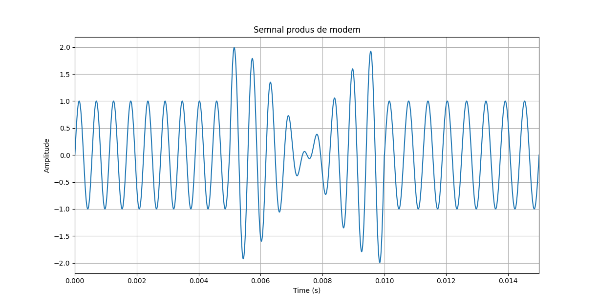
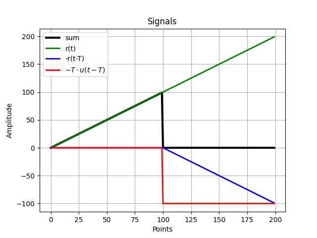
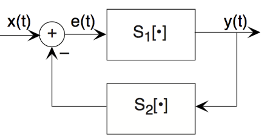

# 🚀 [Signals and Base Systems](https://ocw.cs.pub.ro/courses/ps/labs_python/02)

---

## 📝 Objectives  

- **Frequency Analysis:** Computing and analyzing signal frequencies using **FFT**.  
- **Ramp & Step Functions:** Generating and modifying ramp and step signals with delays.  
- **Complex Exponentials:** Understanding **e^{jt}**, e^{-jt}, and their relation to trigonometry.  
- **Control Systems:** Simulating feedback-based speed control mechanisms.  
- **Visualization:** Graphing signal evolution, complex plane transformations, and feedback performance.  

---

## 🛠️ Key Concepts

---

### ✅ Frequency Analysis of Modem Signals  

- Generates signals with two frequencies (**1600 Hz**, **1800 Hz**).  
- Computes the fundamental period using the **GCD** method.  
- Uses **FFT** to analyze the frequency components.  
- **Visualization:**  
  - Plots modem signals over multiple transmission intervals.  
  - Identifies dominant frequency components using FFT.  

#### Modem Signal Transmission

The transmitted signal consists of a sum of two sinusoids:

$$
x(t) = A_1 \cdot \sin(2 \pi f_1 t) + A_2 \cdot \sin(2 \pi f_2 t)
$$

where:

- $f_1$ $=$ $1600$ Hz
- $f_2$ $=$ $1800$ Hz

To find the minimum transmission interval $ T $, we compute:

$$
T = \frac{1}{\gcd(f_1, f_2)}
$$

  

---

### ✅ Ramp and Step Signal Processing  

- Creates **ramp** and **step** functions using NumPy.  
- Introduces **time delays** and **signal transformations**.  
- Combines signals to reconstruct predefined waveforms.  
- **Visualization:**  
  - Displays individual ramp and step components.  
  - Shows how they combine to generate the final waveform.  

#### Ramp and Step Signal Construction

The required signal is constructed using the ramp function $r{(i)}$ and the unit step function  $u{(i)}$:

$$
s{(i)} = r{(i)} - r(i-T) - T \cdot u(i-T)
$$

where:

- $i$ is the discrete time index,
- $T$ is the delay,
- $r_{(i)}$ is the ramp function,
- $u_{(i)}$ is the unit step function.

  

---

### ✅ Complex Exponentials & Trigonometric Identities  

- Computes **$e^{jt}$** and **$e^{-jt}$** for discrete time values.  
- Verifies **Euler’s identities** and **trigonometric relations**.  
- Plots results in the **complex plane**.  
- **Visualization:**  
  - Displays the unit circle and the placement of complex exponentials.  
  - Compares real and imaginary components of exponential functions.  

#### Euler’s Identity and Complex Exponentials

$$
e^{jt} = \cos(t) + j \sin(t)
$$

$$
e^{-jt} = \cos(t) - j \sin(t)
$$

$$
\cos(t) = \frac{e^{jt} + e^{-jt}}{2}
$$

---

### ✅ Feedback Control System for Car Speed  

- Simulates a car’s speed **reaching a desired value** using a feedback loop.  
- Implements a **decision-based control system**:  
  - If the error **$e{(i)} > 10 $** → Increase speed by **5**.  
  - If the error **$0 < e{(i)} \leq 10$** → Increase speed by **1**.  
  - If the error **$e{(i)} = 0$** → Maintain speed.  
- **Visualization:**  
  - Plots the car’s speed evolution over time.  
  - Highlights error reduction as the feedback system adjusts speed.  

#### Feedback Control System Equations

The speed control is based on the error term:

$$
y(i+1) =
\begin{cases}
y{(i)} + 5, & \text{if } e{(i)} > 10 \\
y{(i)} + 1, & \text{if } 0 < e{(i)} \leq 10 \\
y{(i)}, & \text{if } e{(i)} = 0
\end{cases}
$$

where:

- $y{(i)}$ is the current speed,
- $e{(i)}$ $=$ $x{(i)}$ $-$ $y{(i)}$ is the error between desired and actual speed.

  

---

## 📊 Results  

- **FFT** allows accurate **frequency analysis** of signals.  
- **Signal transformations** help visualize behavior over time.  
- **Complex exponentials** provide a direct link between **trigonometry and signals**.  
- **Feedback control** effectively regulates speed through iterative corrections.  

---
