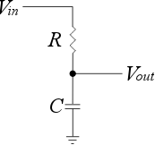

# 🚀 [Phase/Time Shifting and Filtering of Periodic Signals](https://ocw.cs.pub.ro/courses/ps/labs_python/04)

---

## 📝 Objectives  

- **Fourier Series:** Compute and visualize Fourier coefficients for different signals.  
- **Time-Delayed Signals:** Analyze the effect of shifting signals in the time domain.  
- **Low-Pass Filtering:** Apply a low-pass filter to Fourier coefficients to study signal attenuation.  
- **Signal Reconstruction:** Use Fourier coefficients to rebuild signals from their frequency components.  
- **Visualization:** Plot time-domain signals, Fourier coefficients, and filtered signals.  

---

## 🛠️ Key Concepts  

---

### ✅ Fourier Series Analysis  

- Computes Fourier coefficients for a rectangular signal.  
- Uses **time-shifting properties** to analyze delayed signals.  
- **Visualization:**  
  - Plots original and delayed rectangular signals.  
  - Displays magnitude and phase of Fourier coefficients.  
  - Compares reconstructed and original signals.  

| **Concept** | **Mathematical Expression** | **Explanation** |
|:----------:|:-------------------------:|:---------------:|
| **Amplitude of the Signal** | $A$ | The maximum magnitude of the signal, determining its peak value. |
| **Period of the Signal** | $T$ | The duration after which the signal repeats. |
| **Fourier Series Representation** | $s_r(t) = \sum_{k=-\infty}^{\infty} c_k e^{j \frac{2\pi k t}{T}}$ | Represents a periodic signal as a sum of exponentials with different frequencies. |
| **Fourier Coefficients Formula** | $c_k = \frac{1}{T} \int_0^T s(t) e^{-j \frac{2\pi k t}{T}} dt$ | Computes the contribution of each frequency component to the signal. |
| **Fourier Coefficients - Rectangular Wave** |  

 | Shows that only odd harmonics contribute, and the coefficient magnitude decreases with $k$. |

---

### ✅ Time-Delayed Signals  

- Introduces a **$T/4$** delay to the rectangular signal.  
- Computes Fourier coefficients before and after the delay.  
- **Visualization:**  
  - Shows how the delay affects the signal in the time domain.  
  - Demonstrates phase changes in the Fourier coefficients.  

| **Concept** | **Mathematical Expression** | **Explanation** |
|:----------:|:-------------------------:|:---------------:|
| **Phase Shift due to Time Delay** | $c_k' = c_k \cdot e^{-j 2\pi k \frac{\tau}{T}}$ | A time shift $\tau$ affects only the phase of Fourier coefficients. |
| **Reconstructed Delayed Signal** | $s_d(t) = \sum_{k=-\infty}^{\infty} c_k' e^{j \frac{2\pi k t}{T}}$ | The reconstructed signal with a phase shift in the frequency domain. |

---

### ✅ Low-Pass Filtering  

- Implements a **low-pass filter** to remove high-frequency components.  
- Compares different cutoff frequencies to analyze their effect.  
- **Visualization:**  
  - Plots Fourier coefficients before and after filtering.  
  - Observes attenuation of high-frequency components.  

A **low-pass filter** allows low-frequency signals to pass while attenuating high-frequency components. One of the most common implementations is the **RC low-pass filter**, which consists of a **resistor $R$** and a **capacitor $C$**.

#### Circuit Diagram

    

- **$R$ (resistor)** controls how much voltage is dropped.
- **$C$ (capacitor)** accumulates charge, filtering high-frequency components.
- **$V_{in}$** is the input signal.
- **$V_{out}$** is the filtered output signal.

#### Steps to Apply Low-Pass Filtering  

1️⃣ **Generate the input pulse signal and plot it.**  

- Use **$T = 100$ samples** where only **$\Delta = 20$** values are non-zero.

2️⃣ **Compute the first $N = 31$ positive Fourier coefficients $c_k$.**  

- Plot the **magnitude** of the coefficients using `plt.stem` and `np.abs`.

3️⃣ **Apply the RC filter transfer function $H(f)$ to compute $c_k^y$.**  

- Select different **cutoff frequencies $f_c$** using $RC = \frac{1}{2\pi f_c}$.

4️⃣ **Reconstruct the filtered signal using the Fourier series.**  

- Compare the original and filtered signals to observe the effect of attenuation.

| **Concept** | **Mathematical Expression** | **Explanation** |
|:----------:|:-------------------------:|:---------------:|
| **Filtered Fourier Coefficients** | $c_k^y = H\left( \frac{k}{T} \right) \cdot c_k$ | The effect of the filter is applied directly to the Fourier coefficients. |
| **Low-Pass Filter Transfer Function** | $H(f = \frac{k}{T}) = \frac{1}{1 + j 2\pi RC \frac{k}{T}}$ | Describes how the RC filter attenuates high frequencies. |

- Different cutoff frequencies $f_c$ affect the filter strength:
  - $f_c = \frac{0.1}{T}$ → **Strong filtering** (removes most high frequencies).
  - $f_c = \frac{1}{T}$ → **Moderate filtering** (preserves the fundamental frequency).
  - $f_c = \frac{10}{T}$ → **Weak filtering** (retains most frequencies).

---

### ✅ Signal Reconstruction  

- Reconstructs signals using Fourier coefficients.  
- Compares **original**, **delayed**, and **filtered** versions.  
- **Visualization:**  
  - Plots reconstructed signals using different Fourier terms.  
  - Evaluates the accuracy of signal recovery.  

| **Concept** | **Mathematical Expression** | **Explanation** |
|:----------:|:-------------------------:|:---------------:|
| **Reconstructed Signal after Filtering** | $s_y(t) = \sum_{k=-\infty}^{\infty} c_k^y e^{j \frac{2\pi k t}{T}}$ | The filtered signal reconstructed from modified Fourier coefficients. |

### 🔥 Key Observations

- **Time shift in the time domain → Phase shift in the frequency domain.**  
- **Fourier coefficients decrease** as frequency $k$ increases.  
- The **original signal is perfectly sharp**, but the reconstructed signal has **ringing artifacts** due to the **finite summation of terms**.  
- Increasing **$N$ (number of terms)** improves the **accuracy of reconstruction**.  
- The **Gibbs phenomenon** persists near **sharp transitions**, regardless of how many Fourier terms are used.  
- **Low-pass filtering removes high-frequency noise and smoothens signals.**  

---

## 📊 Results  

- Time delay affects phase but not magnitude of Fourier coefficients.
- Low-pass filtering removes high-frequency components, making signals smoother.
- More Fourier terms improve reconstruction accuracy.
- Fourier analysis effectively decomposes and reconstructs time-domain signals.

---
