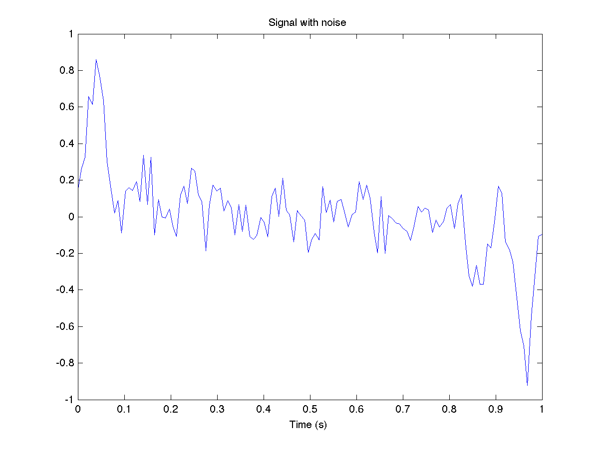
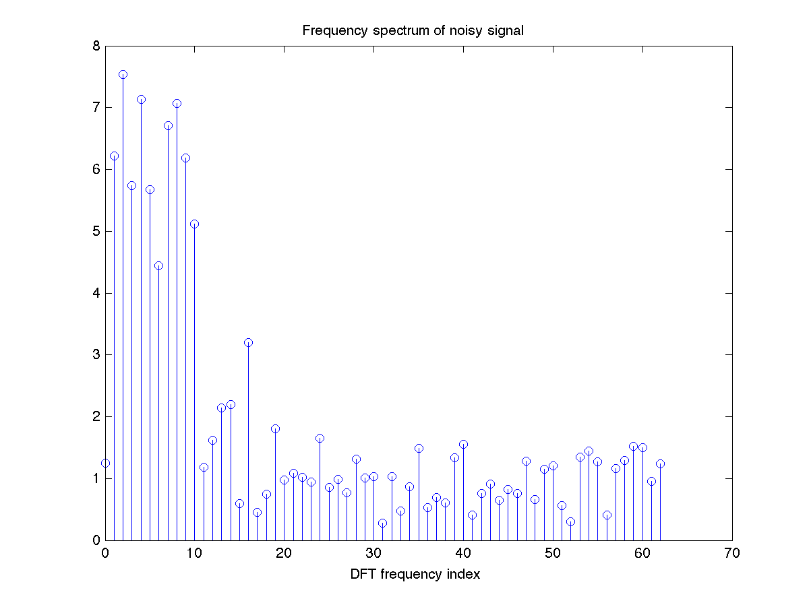
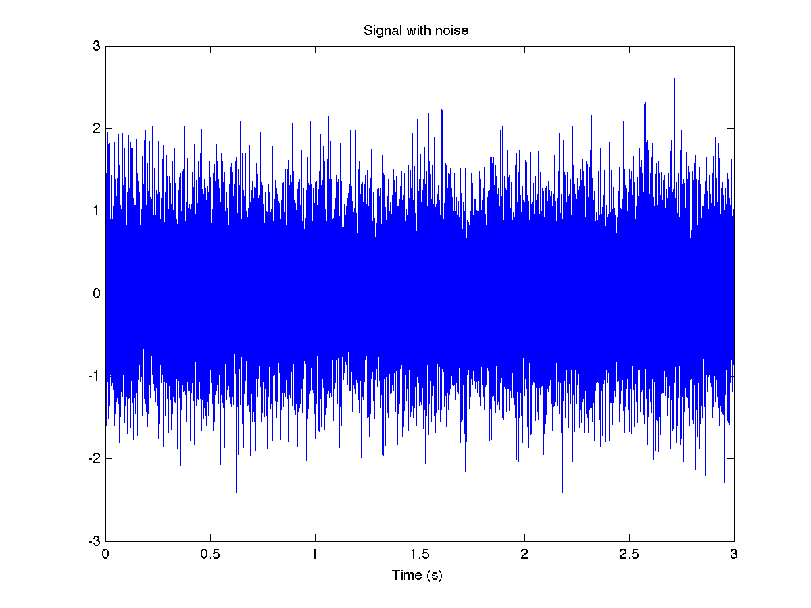
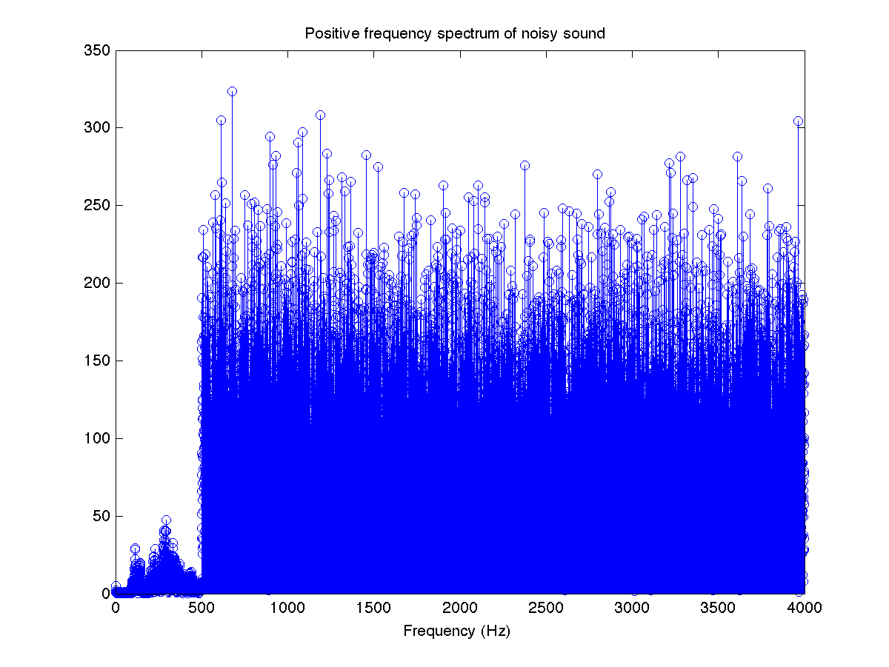
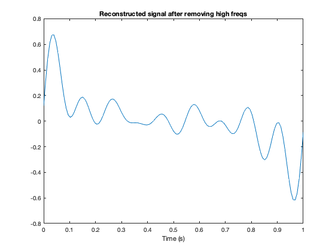
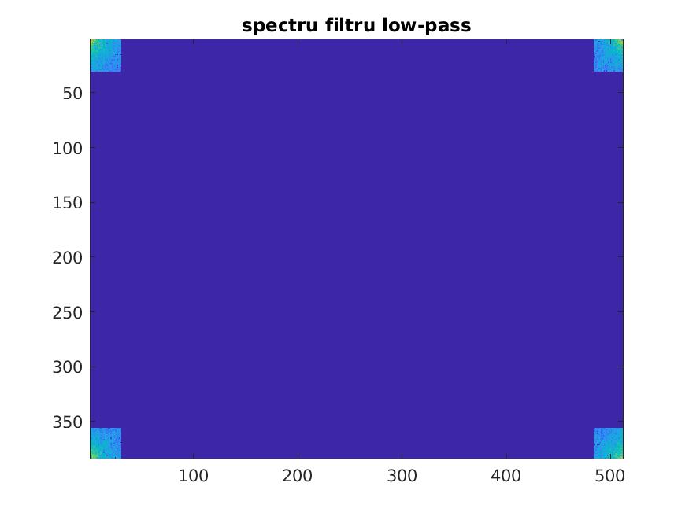
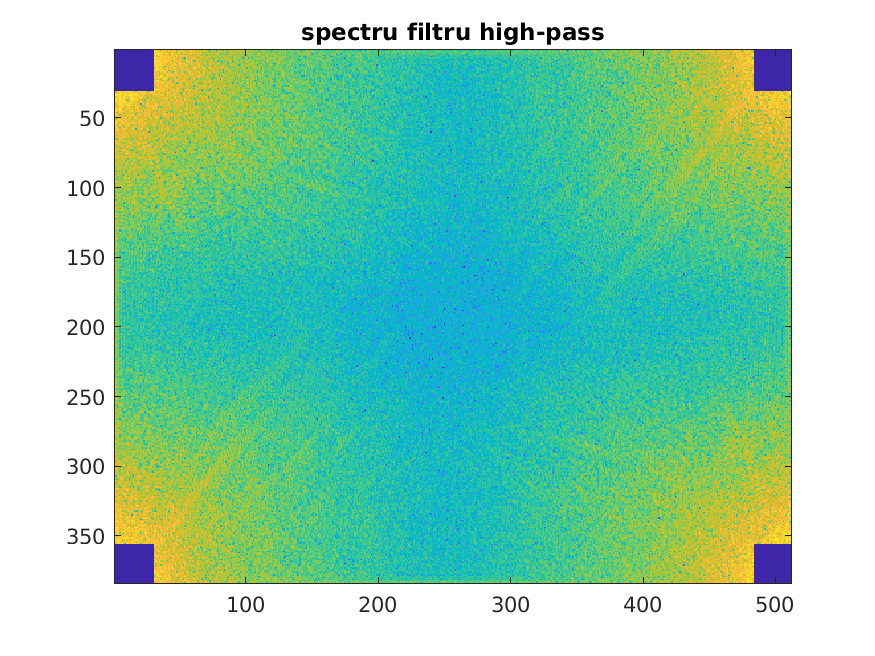
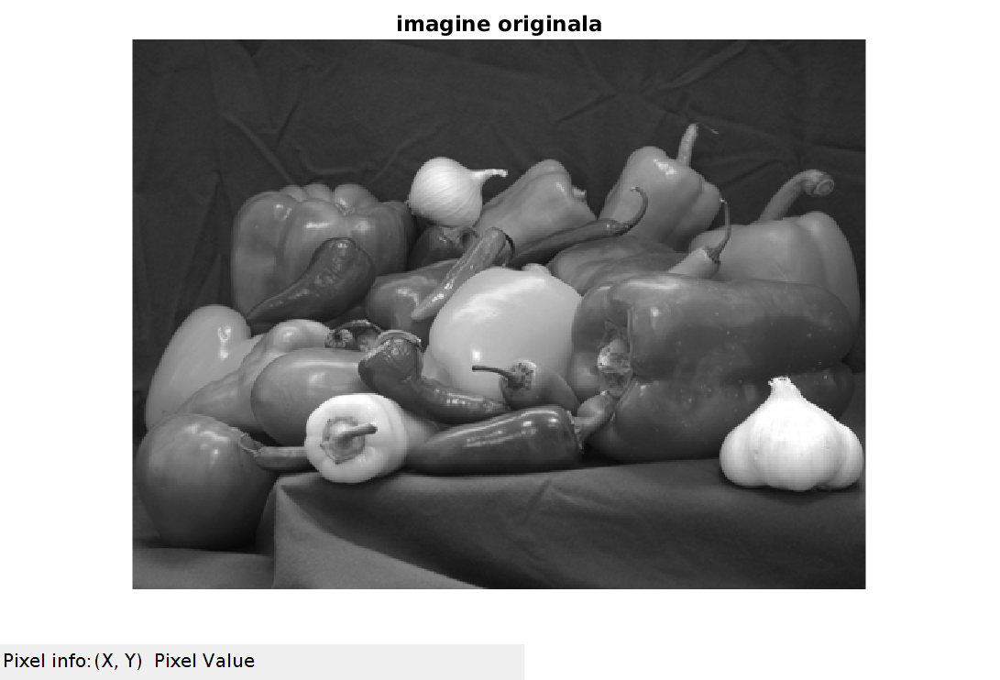
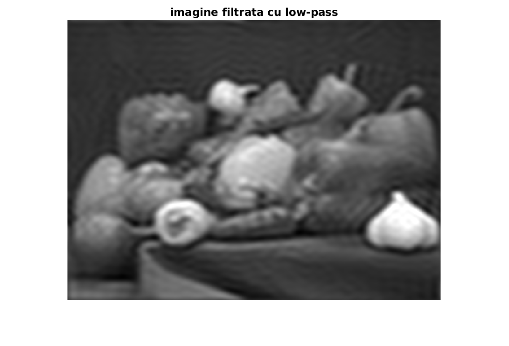
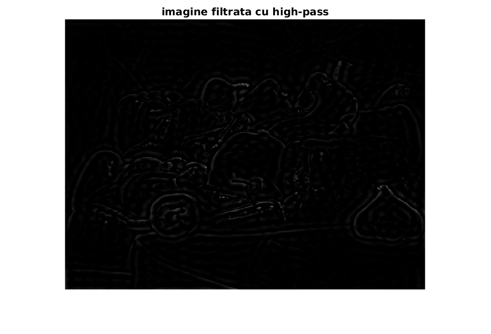

# 🚀 [Digital Signal Processing - Fourier Analysis, Filtering, and Modulation](https://ocw.cs.pub.ro/courses/ps/labs_python/06)

---

## 📝 Objectives  

- **Fourier Analysis:** Compute and visualize Fourier coefficients of different signals.  
- **Discrete Fourier Transform (DFT):** Implement **DFT** and **IDFT** to analyze and reconstruct signals.  
- **Fast Fourier Transform (FFT):** Utilize **FFT** for efficient spectral decomposition.  
- **Signal Filtering:** Apply filtering techniques to remove noise and enhance signal quality.  
- **Amplitude Modulation:** Perform amplitude modulation and analyze its effect on frequency components.  
- **Visualization:** Graph signals in the time and frequency domains for better understanding.  

---

## 🛠️ Key Concepts  

---

### ✅ Fourier Series and DFT  

- Computes Fourier coefficients for a **rectangular signal**.  
- Implements **DFT (Discrete Fourier Transform)** for spectral analysis.  
- Uses **FFT (Fast Fourier Transform)** to improve computational efficiency.  
- **Visualization:**  
  - Plots the original signal.  
  - Displays the magnitude of Fourier coefficients.  
  - Compares reconstructed and original signals.  

| **Concept** | **Mathematical Expression** | **Explanation** |
|:----------:|:-------------------------:|:---------------:|
| **Discrete Fourier Transform (DFT)** | \( S(k) = \sum\limits_{n=0}^{N-1} s(n) e^{-j \frac{2\pi nk}{K}} \) | Converts a discrete-time signal into its frequency-domain representation. |
| **Inverse Discrete Fourier Transform (IDFT)** | \( s(n) = \frac{1}{K} \sum\limits_{k=0}^{K-1} S(k) e^{j \frac{2\pi nk}{K}} \) | Reconstructs the original signal from frequency components. |

---

### ✅ Noise and Filtering  

- **Noise Analysis:** Examines signals with added noise in both time and frequency domains.  
- **Spectral Analysis:** Identifies dominant frequency components.  
- **Filtering:** Removes unwanted frequencies for signal enhancement.  
- **Visualization:**  
  - Plots noisy signal and its frequency spectrum.  
  - Compares signals before and after filtering.  

| **Concept** | **Mathematical Expression** | **Explanation** |
|:----------:|:-------------------------:|:---------------:|
| **Signal Power Calculation** | \( \text{P} = \frac{1}{N} \sum\limits_{k=0}^{N-1} \|S(k)\|^2 \) | Computes the power of the signal components. |
| **Signal-to-Noise Ratio (SNR)** | \( \text{SNR} = 10 \log_{10} \left(\frac{P_{\text{signal}}}{P_{\text{noise}}}\right) \) | Measures the quality of the signal by comparing useful information to noise. |
---

### 📌 Noisy Signal Analysis

| Noisy Signal | Frequency Spectrum of Noisy Signal |
|:-----------:|:------------------------------:|
|  |  |
| **Represents a signal with added noise.** The noise affects the overall waveform, making it harder to interpret the useful components. | **Shows the frequency spectrum of the noisy signal.** Noise spreads across the frequency domain, while useful components are concentrated in the first few frequency bins. |

---

### 📌 Noisy Sound Analysis

| Noisy Sound Waveform | Frequency Spectrum of Noisy Sound |
|:--------------------:|:-------------------------------:|
|  |  |
| **Illustrates a noisy audio signal over time.** The noise introduces significant variations in amplitude, making the waveform look chaotic. | **Displays the spectral distribution of the noisy sound.** Dominant frequency components are highlighted, showing the energy spread across different frequencies. |

---

### 📌 Reconstructed Signal After Filtering

  

Signal reconstruction after removing high frequencies. Filtering reduces noise and retains essential signal components.

### 🔥 Key Observations  

- **DFT efficiently decomposes signals into frequency components.**  
- **FFT significantly improves spectral computation speed.**  
- **Filtering removes noise and enhances signal clarity.**  
- **Amplitude Modulation shifts frequency content, enabling signal transmission.**  
- **Higher Fourier coefficients improve reconstruction accuracy.**  

---

### ✅ Image Processing using Fourier Transform  

- Applies **2D Fourier Transform (FFT2)** on grayscale images.  
- Implements **low-pass** and **high-pass** frequency filtering.  
- Uses **IFFT2** to reconstruct filtered images.  
- **Visualization:**  
  - Displays original and filtered images.  
  - Shows frequency spectrum analysis.  

---

### 📌 Low-High Pass Filters

| **Low-Pass Filter Spectrum** | **High-Pass Filter Spectrum** |
|:----------------------------:|:----------------------------:|
|  |  |
| **Frequency response of low-pass filtering.** High frequencies are attenuated, keeping only low-frequency details. | **Frequency response of high-pass filtering.** Low frequencies are suppressed, enhancing high-frequency components like edges. |

---

### 📌 Filtered Image

| **Original Image** | **Low-Pass Filtered Image** | **High-Pass Filtered Image** |
|:------------------:|:-------------------------:|:---------------------------:|
|  |  |  |
| **The original grayscale image.** Serves as input for Fourier-based filtering. | **Blurs high-frequency details.** Retains only smooth variations in intensity. | **Enhances edges and sharp features.** Suppresses low-frequency content. |

---

### 🔥 Key Observations  

- **DFT efficiently decomposes signals into frequency components.**  
- **FFT significantly improves spectral computation speed.**  
- **Filtering removes noise and enhances signal clarity.**  
- **Amplitude Modulation shifts frequency content, enabling signal transmission.**  
- **Higher Fourier coefficients improve reconstruction accuracy.**  
- **Low-pass filtering retains smooth regions, while high-pass filtering enhances edges.**  

---

## 📊 Results  

- **Time and frequency analysis** provide insights into signal characteristics.  
- **Noise filtering techniques** effectively enhance signal quality.  
- **Fourier Transform aids in decomposition, filtering, and modulation analysis.**  
- **DFT, FFT, and filtering techniques** are fundamental in digital signal processing.  
- **Fourier transform-based image filtering successfully extracts edges or smooths images.**  

---
