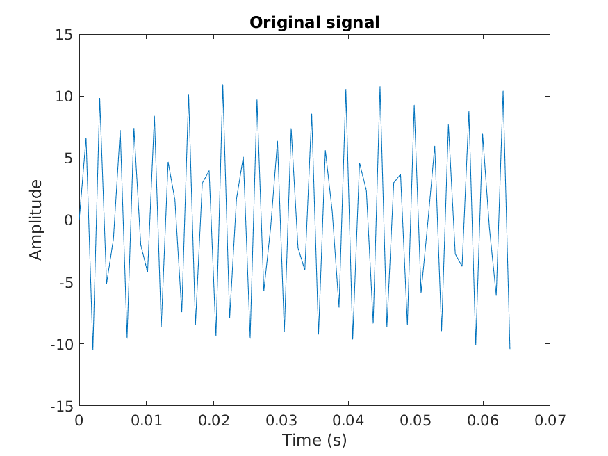
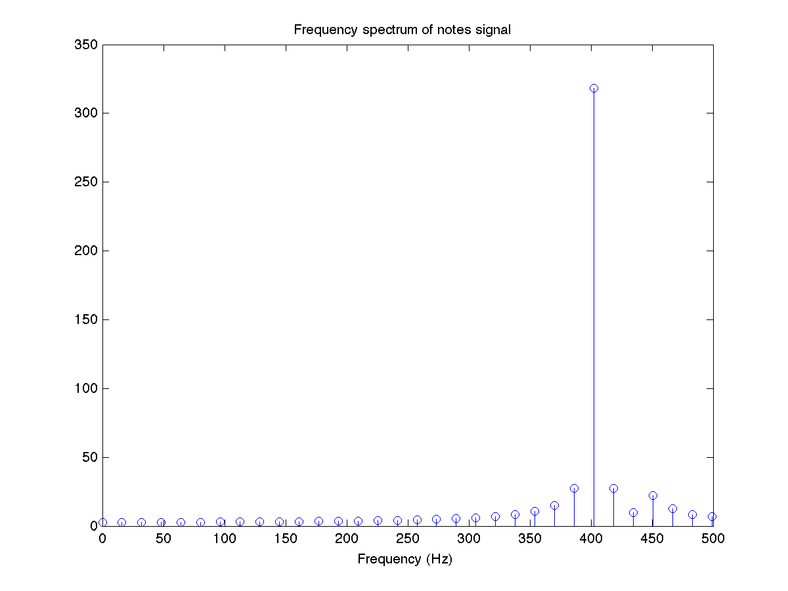
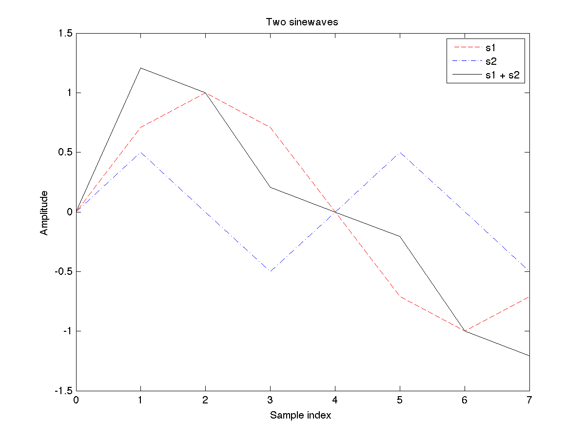
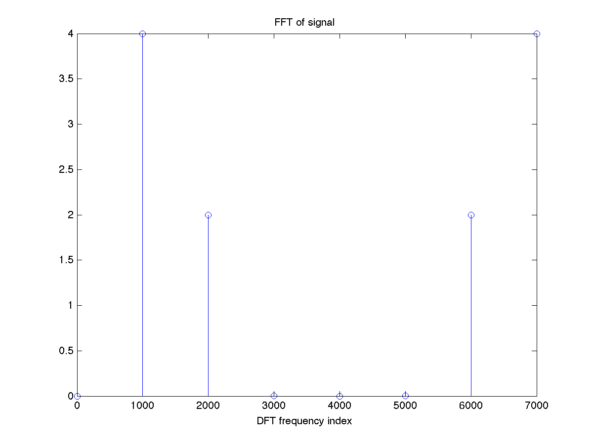
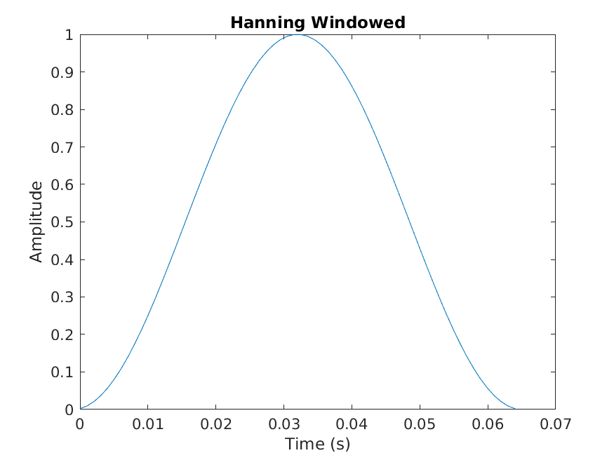
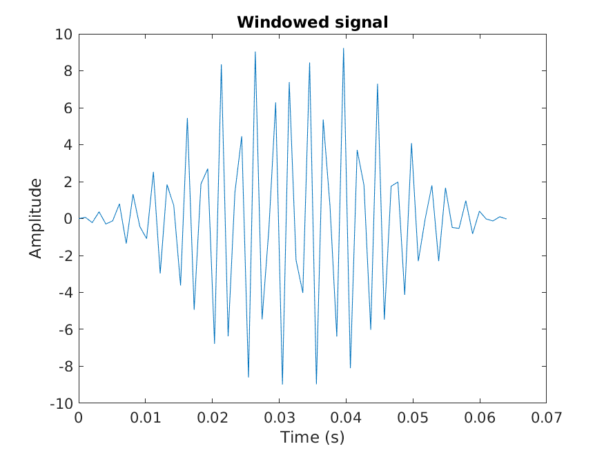

# 🚀 [DFT in detail: DFT leakage, zero-padding](https://ocw.cs.pub.ro/courses/ps/labs_python/07)

---

## 📝 Objectives  

- **Fourier Analysis:** Compute and visualize Fourier transforms for different signals.  
- **FFT & IFFT:** Implement **Fast Fourier Transform (FFT)** and its inverse for signal reconstruction.  
- **Signal Filtering:** Use Hanning windows and frequency domain filtering to remove noise.  
- **Spectrogram Analysis:** Analyze time-frequency representations of signals.  
- **Audio Processing:** Load, filter, and save audio signals.  

---

## 🛠️ Key Concepts  

---

### ✅ Fourier Transform & Spectrum Analysis  

- Computes **DFT** and **FFT** for a given signal.  
- Analyzes frequency content using **spectrograms**.  
- **Visualization:**  
  - Plots the original time-domain signal.  
  - Displays the magnitude spectrum.  
  - Demonstrates spectral shifting techniques.  

<table align="center">
  <tr>
    <th>Original Signal</th>
    <th>Fourier Transform Spectrum</th>
  </tr>
  <tr>
    <td align="center"></td>
    <td align="center"></td>
  </tr>
  <tr>
    <td align="center"><b>The original signal contains two sinusoidal components with different amplitudes.</b></td>
    <td align="center"><b>The frequency spectrum shows dominant peaks, but one frequency is overshadowed due to spectral leakage.</b></td>
  </tr>
</table>

---

### ✅ DFT Leakage and Zero-Padding  

- **DFT Leakage** occurs when the signal does not perfectly match a periodic window.  
- **Zero-Padding** improves frequency resolution by adding zeros to the signal.  
- **Visualization:**  
  - Shows the effect of zero-padding on DFT resolution.  

| **DFT without Zero-Padding** | **DFT with Zero-Padding** |
|:---------------------------:|:-------------------------:|
|  |  |
| **With limited samples, the spectral resolution is poor, causing leakage effects.** | **Zero-padding enhances frequency resolution, making the sinc function clearer.** |

---

### ✅ Signal Windowing  

- Applies **Hanning Window** to improve spectral characteristics.  
- Reduces spectral leakage for better analysis.  
- **Visualization:**  
  - Shows the effect of windowing on frequency domain representations.  

| **Original Signal** | **Hanning Window** | **Windowed Signal** |
|:------------------:|:-----------------:|:------------------:|
|  |  |  |
| **The original time-domain signal before any modifications.** | **A Hanning window tapers the edges of the signal to reduce spectral leakage.** | **Multiplying the original signal by the window reduces frequency smearing.** |

---

### ✅ Filtering in Frequency Domain  

- Implements **low-pass and high-pass filtering** to remove unwanted frequencies.  
- Enhances signal clarity and removes noise.  
- **Visualization:**  
  - Compares filtered and unfiltered spectrums.  
  - Shows reconstructed signals after filtering.  

---

### ✅ Audio Processing & Playback  

- Loads **noisy audio signals** for analysis.  
- Filters and reconstructs the signal using FFT.  
- Saves the processed signal as a **WAV file**.  
- **Playback:**  
  - Plays original and filtered audio using **sounddevice**.  

---

## 📊 Results  

- FFT effectively decomposes signals into frequency components.  
- Windowing improves spectral analysis by reducing leakage.  
- Frequency filtering enhances signal clarity and removes unwanted noise.  
- Processed audio signals maintain quality and improve perceptibility.  

---
