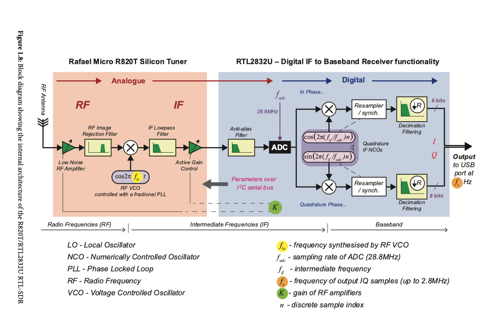
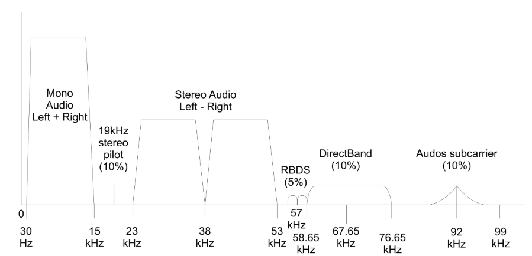

# 📡 [FM Signal Processing with RTL-SDR](https://ocw.cs.pub.ro/courses/ps/labs/08)

---

## 📝 Overview

This project focuses on processing **FM signals** captured using an **RTL-SDR** (Software Defined Radio) device or pre-recorded signals.  
The main tasks include **signal filtering, decimation, frequency demodulation, and audio extraction**.

### 🎯 Objectives

- **Capture an FM signal** using an RTL-SDR device or a pre-recorded signal.
- **Filter the signal** using a **low-pass FIR filter** to remove unwanted frequencies.
- **Decimate the signal** to reduce the sampling rate while maintaining useful data.
- **Demodulate FM signals** using a simple frequency discriminator.
- **Extract and play audio** from the demodulated FM signal.
- **Analyze frequency components** using **Fourier Transform (FFT)**.
- **Save processed signals** and spectrograms for further analysis.

---

## 🛠️ Key Concepts

---

### ✅ Signal Capture (RTL-SDR)

- Captures raw **IQ samples** from an **RTL-SDR** tuner.
- Uses **librtlsdr** for tuning and receiving data.
- Saves the captured signal for later processing.

<p align="center">
  
</p>

**Figure 1** - Block diagram of the **RTL-SDR** system, showing how an FM signal is received, converted, and processed digitally.

---

### ✅ Spectrogram Analysis

- Computes and visualizes the **spectrogram** of the received **FM signal**.
- Displays how signal energy is distributed across different frequencies over time.

<p align="center">
  
</p>

**Figure 2** - Spectrogram of an FM signal, showing dominant frequency components.

---

### ✅ Signal Filtering

- Uses an **FIR low-pass filter** to remove unwanted frequencies.
- Applies a **Hamming window** to reduce spectral leakage.
- Plots the **filtered signal’s frequency spectrum**.

---

### ✅ Signal Decimation

- Reduces the sampling rate to match the **FM signal bandwidth**.
- Improves computational efficiency while preserving key signal features.

---

### ✅ FM Demodulation

- Implements **FM demodulation** using a **frequency discriminator**.
- Extracts the **baseband audio signal** from the FM carrier.
- Visualizes the **Power Spectral Density (PSD)** of the demodulated signal.

---

### ✅ Audio Extraction & Playback

- Filters the **audio signal (0-15 kHz)** for **mono FM playback**.
- Decimates the audio signal to **44.1 kHz** for standard playback.
- Saves the extracted audio as a **WAV file** and plays it.

---

## 📦 Installation & Requirements

### 1️⃣ Install Dependencies

```bash
pip install rtlsdr matplotlib scipy sounddevice numpy
```

### 2️⃣ Install RTL-SDR Drivers (if using an SDR device)

```bash
sudo apt-get install librtlsdr-dev  # 🔹 Linux
brew install librtlsdr  # 🔹MacOS (Homebrew)
```

### 3️⃣ Run the script

To process a **pre-recorded signal**, simply run:

```bash
python ex3.py
# To capture live **FM signals** using RTL-SDR, enable the SDR mode:
use_sdr: int = 1  # Change 0 to 1 in the script to enable SDR mode
```

### 🎵 Playing Extracted Audio

Once the script runs successfully, it will play the **extracted audio**. You can also manually play the saved `.wav` file:

```bash
aplay x1.wav  # Linux/macOS
start x1.wav  # Windows
```

### 📁 Output Files

| **File**                      | **Description**                              |
|--------------------------------|----------------------------------------------|
| `spectrum_signal.png`         | Spectrogram of the original FM signal       |
| `filtered_spectrum_signal.png`| Spectrogram of the filtered FM signal       |
| `decimated_demodulated_signal.png` | Decimated and demodulated FM signal  |
| `demodulated_signal_psd.png`  | Power spectral density of FM demodulation   |
| `out_dem_fm_mono_channel_signal.png` | Extracted mono channel audio FFT |
| `x1.wav`                      | Extracted **audio file** from FM signal     |

---

## 📊 Results & Visualizations

- **Spectrograms** of the original, filtered, and demodulated signals.
- **FFT plots** showing frequency components before and after filtering.
- **Extracted audio** from FM signals for playback.

---
