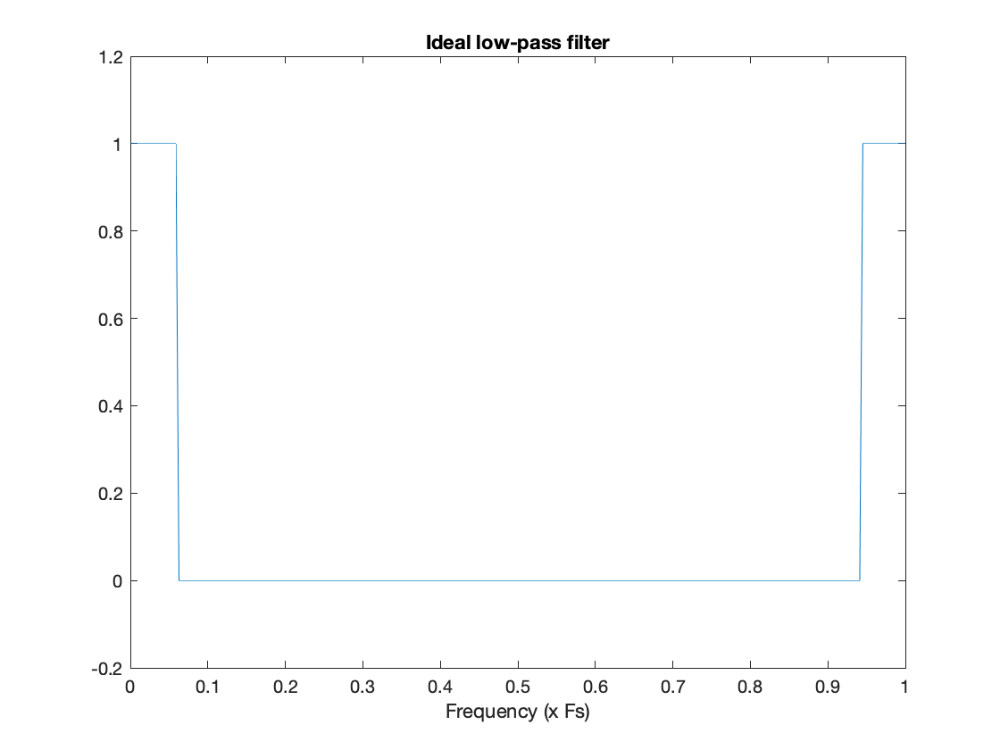

# 🚀 [Convolution, FIR Filters, and the Windowing Design Method](https://ocw.cs.pub.ro/courses/ps/labs_python/09)

---

## 📝 Objectives  

- **Fourier Analysis:** Compute and visualize Fourier coefficients of different signals.  
- **Discrete Fourier Transform (DFT):** Implement **DFT** and **IDFT** to analyze and reconstruct signals.  
- **Fast Fourier Transform (FFT):** Utilize **FFT** for efficient spectral decomposition.  
- **Signal Filtering:** Apply **FIR** and **IIR** filters to remove noise and enhance signal quality.  
- **Amplitude Modulation:** Perform amplitude modulation and analyze its effect on frequency components.  
- **Image Processing:** Use **2D FFT** for image transformation and filtering.  
- **Visualization:** Graph signals in both time and frequency domains for better understanding.  

---

## 🖼️ Filter Visualization  

Here is an example of a **filtered signal** representation:  

  

- **The original signal before filtering is shown in the frequency domain.**  
- **After applying a low-pass filter, high-frequency components are removed.**  
- **This allows the signal to be reconstructed with smoother transitions.**  

---

## 🛠️ Key Concepts  

### ✅ Fourier Transform and Spectral Analysis  

The **Discrete Fourier Transform (DFT)** is given by:

\[
X(k) = \sum_{n=0}^{N-1} x(n) e^{-j2\pi kn/N}
\]

The **Inverse DFT (IDFT)** is given by:

\[
x(n) = \frac{1}{N} \sum_{k=0}^{N-1} X(k) e^{j2\pi kn/N}
\]

- Computes Fourier coefficients for a **rectangular signal**.  
- Implements **DFT (Discrete Fourier Transform)** and **Inverse DFT (IDFT)** for spectral analysis.  
- Uses **FFT (Fast Fourier Transform)** to improve computational efficiency.  
- **Visualization:**  
  - Plots the original signal.  
  - Displays the magnitude of Fourier coefficients.  
  - Compares reconstructed and original signals.  

---

## 📌 Convolution and FIR Filters  

### 🔹 Convolution  

The convolution operation between two sequences \( h(k) \) and \( x(n) \) is defined as:

\[
y(n) = h(k) * x(n) = \sum_{k=0}^{M-1} h(k) \cdot x(n - k)
\]

where \( M \) is the length of sequence \( h(k) \).

Convolution defines a single output element \( y(n) \), and for the next element \( y(n+1) \), we shift \( h(k) \) accordingly.

- **Example:**
  - If \( x(n) \) has \( N \) elements and \( h(k) \) has \( M \) elements, the convolved sequence has \( N + M - 1 \) elements.

---

### 🔹 FIR (Finite Impulse Response) Filters  

An FIR filter applies a linear convolution over input signals using a **finite number of coefficients**:

\[
y(n) = b_0 \cdot x(n) + b_1 \cdot x(n-1) + \dots + b_q \cdot x(n-q)
\]

The **Transfer Function** of the FIR filter in the Z-domain is:

\[
H(z) = \sum_{k=0}^{q} b_k z^{-k}
\]

---

### 🔹 IIR (Infinite Impulse Response) Filters  

An **IIR filter** includes feedback terms and follows the difference equation:

\[
y(n) = b_0 \cdot x(n) + b_1 \cdot x(n-1) + \dots + b_q \cdot x(n-q) + a_1 \cdot y(n-1) + \dots + a_p \cdot y(n-p)
\]

The **Transfer Function** in the Z-domain is:

\[
H(z) = \frac{\sum_{k=0}^{q} b_k z^{-k}}{1 - \sum_{k=1}^{p} a_k z^{-k}}
\]

---

### ✅ Amplitude Modulation  

**Amplitude Modulation (AM)** involves multiplying a baseband signal \( x(t) \) with a carrier \( \cos(2\pi f_c t) \):

\[
s(t) = x(t) \cos(2\pi f_c t)
\]

The **Fourier Transform** of the modulated signal results in frequency shifts:

\[
S(f) = \frac{1}{2} X(f - f_c) + \frac{1}{2} X(f + f_c)
\]

- Generates an **exponentially decaying** signal.  
- Modulates it with a **cosine carrier wave** for **AM transmission**.  
- **Visualization:**  
  - Displays the modulated waveform.  
  - Shows Fourier spectrum before and after modulation.  

---

### ✅ Image Processing with FFT  

- Converts **RGB images to grayscale**.  
- Computes **2D FFT** to analyze frequency components.  
- Applies **Low-Pass and High-Pass Filtering** to remove unwanted frequencies.  
- **Visualization:**  
  - Displays original, grayscale, and filtered images.  
  - Shows frequency spectrum and reconstructed images.  

---

## 📊 Results  

- Increasing Fourier coefficients improves signal reconstruction.  
- FFT significantly speeds up frequency analysis.  
- Amplitude Modulation shifts frequency content as expected.  
- Filtering techniques effectively reduce noise and enhance signal quality.  
- Image processing with FFT helps in frequency-based modifications.  

---
