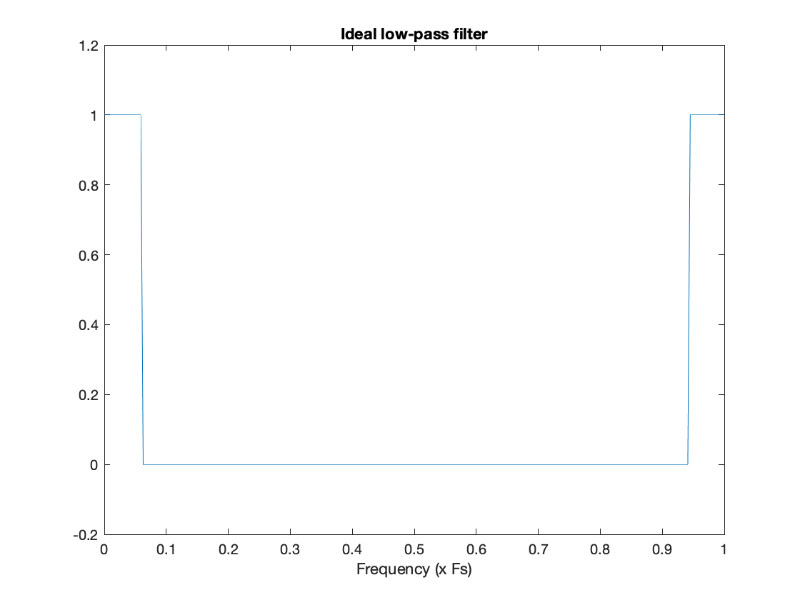

# 🚀 [Bandpass and highpass FIR filters, IIR filters](https://ocw.cs.pub.ro/courses/ps/labs_python/10)

---

## 📝 Objectives  

- **Fourier Analysis:** Compute and visualize Fourier coefficients of different signals.  
- **Discrete Fourier Transform (DFT):** Implement **DFT** and **IDFT** to analyze and reconstruct signals.  
- **Fast Fourier Transform (FFT):** Utilize **FFT** for efficient spectral decomposition.  
- **Finite Impulse Response (FIR) Filters:** Design FIR filters using **windowing techniques**.  
- **Infinite Impulse Response (IIR) Filters:** Apply **Butterworth and Chebyshev Type I** filters for signal processing.  
- **Spectral Analysis:** Compute and visualize frequency domain representations.  
- **Signal Filtering:** Apply **low-pass, high-pass, and band-pass filters** to remove noise and enhance signal quality.  
- **Visualization:** Graph signals in both time and frequency domains for better understanding.  

---

## 📷 Filter Design Visualization  

Below is an example of FIR and IIR filter response:  

  

- **The original signal before filtering is shown in the frequency domain.**  
- **After applying a low-pass filter, high-frequency components are removed.**  
- **This allows the signal to be reconstructed with smoother transitions.**  

---

## 🛠️ Key Concepts  

### ✅ Fourier Transform and Spectral Analysis  

The **Discrete Fourier Transform (DFT)** is given by:

$$X(k) = \sum_{n=0}^{N-1} x(n) e^{-j2\pi kn/N}$$

The **Inverse DFT (IDFT)** is given by:

$$x(n) = \frac{1}{N} \sum_{k=0}^{N-1} X(k) e^{j2\pi kn/N}$$

- Computes Fourier coefficients for a **rectangular signal**.  
- Implements **DFT (Discrete Fourier Transform)** and **Inverse DFT (IDFT)** for spectral analysis.  
- Uses **FFT (Fast Fourier Transform)** for computational efficiency.  
- **Visualization:**  
  - Plots the original signal.  
  - Displays the magnitude of Fourier coefficients.  
  - Compares reconstructed and original signals.  

---

## 📌 Convolution and FIR Filters  

### 🔹 Convolution  

The convolution operation between two sequences $h(k)$ and $x(n)$ is defined as:

$$y(n) = h(k) * x(n) = \sum_{k=0}^{M-1} h(k) \cdot x(n - k)$$

where $M$ is the length of sequence $h(k)$.

Convolution defines a single output element $y(n)$, and for the next element $y(n+1)$, we shift $h(k)$ accordingly.

- **Example:**
  - If $x(n)$ has $N$ elements and $h(k)$ has $M$ elements, the convolved sequence has $N + M - 1$ elements.

---

### 🔹 FIR (Finite Impulse Response) Filters  

An FIR filter applies a linear convolution over input signals using a **finite number of coefficients**:

$$y(n) = b_0 \cdot x(n) + b_1 \cdot x(n-1) + \dots + b_q \cdot x(n-q)$$

The **Transfer Function** of the FIR filter in the Z-domain is:

$$H(z) = \sum_{k=0}^{q} b_k z^{-k}$$

---

### 🔹 IIR (Infinite Impulse Response) Filters  

An **IIR filter** includes feedback terms and follows the difference equation:

$$y(n) = b_0 \cdot x(n) + b_1 \cdot x(n-1) + \dots + b_q \cdot x(n-q) + a_1 \cdot y(n-1) + \dots + a_p \cdot y(n-p)$$

The **Transfer Function** in the Z-domain is:

$$H(z) = \frac{\sum_{k=0}^{q} b_k z^{-k}}{1 - \sum_{k=1}^{p} a_k z^{-k}}$$

---

## 📌 FIR Filter Design Using Windowing  

- Uses **window functions** to smooth the impulse response and reduce side lobes.  
- Implements **Blackman windowing** to refine filter characteristics.  

$$h(n) = h_{\text{ideal}}(n) \cdot w(n)$$

where $w(n)$ is a **Blackman window** or another smoothing function.  

---

## 📌 IIR Filter Design with Butterworth and Chebyshev  

- Designs **Butterworth filters** for maximally flat frequency response.  
- Implements **Chebyshev Type I filters** for steeper roll-off characteristics.  

A **Butterworth low-pass filter** of order $N$ has the frequency response:

$$H(j\omega) = \frac{1}{\sqrt{1 + \left(\frac{\omega}{\omega_c}\right)^{2N}}}$$

where $\omega_c$ is the cutoff frequency.  

---

## 📌 Filtered Signal Processing  

- Tests filtering on **sinusoidal signals** at various frequencies.  
- Demonstrates **band-pass and high-pass filtering** on test signals.  

$$x_{\text{filtered}}(n) = h(n) * x(n)$$

where $h(n)$ is the impulse response of the filter.

---

## 📊 Results  

- Fourier transforms allow accurate spectral decomposition of signals.  
- Windowing methods improve FIR filter performance.  
- IIR filters provide efficient filtering with lower computational cost.  
- Filtering techniques effectively reduce noise and enhance signal quality.  
- Frequency domain visualization helps in analyzing filter characteristics.  

---
